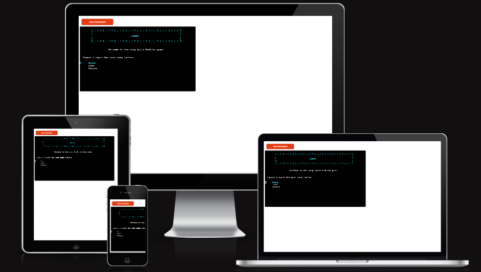
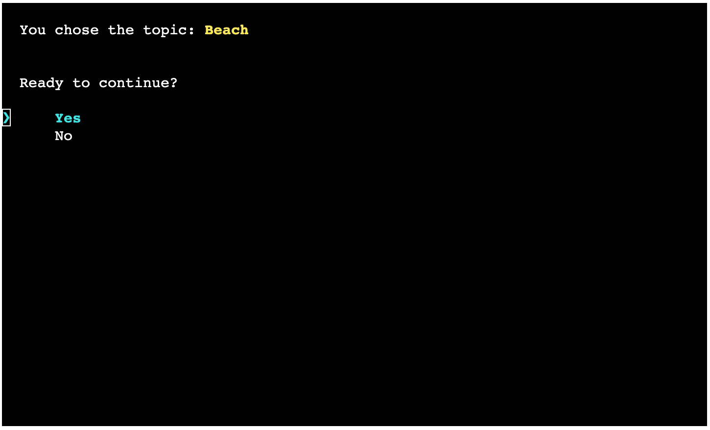
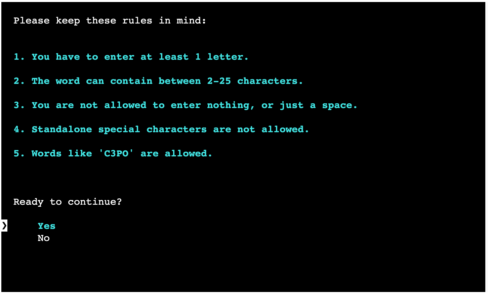
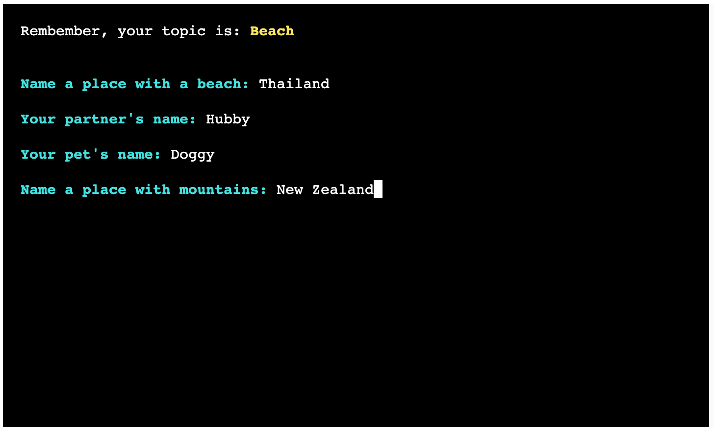
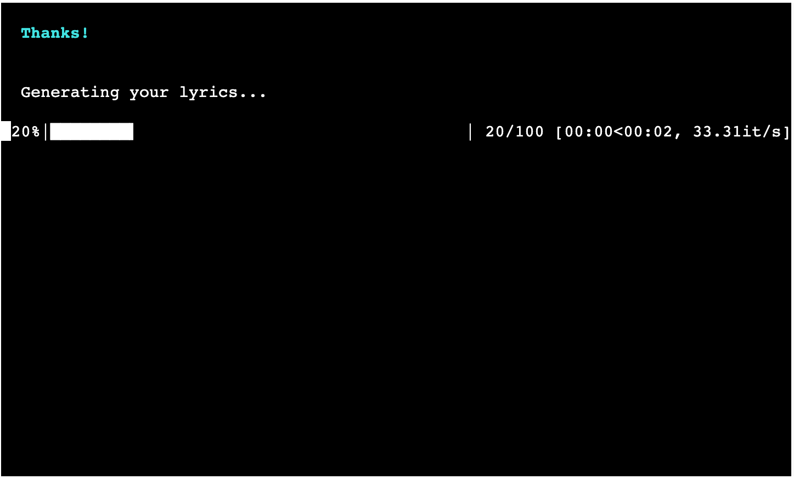
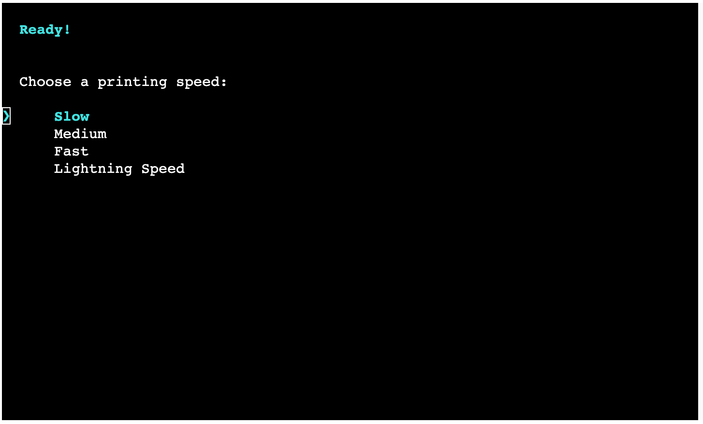
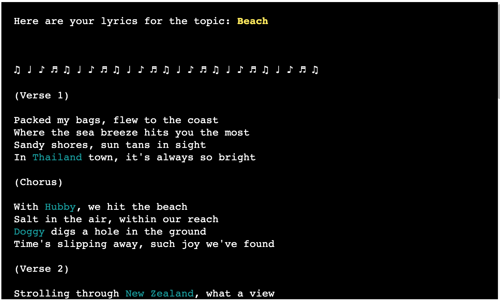
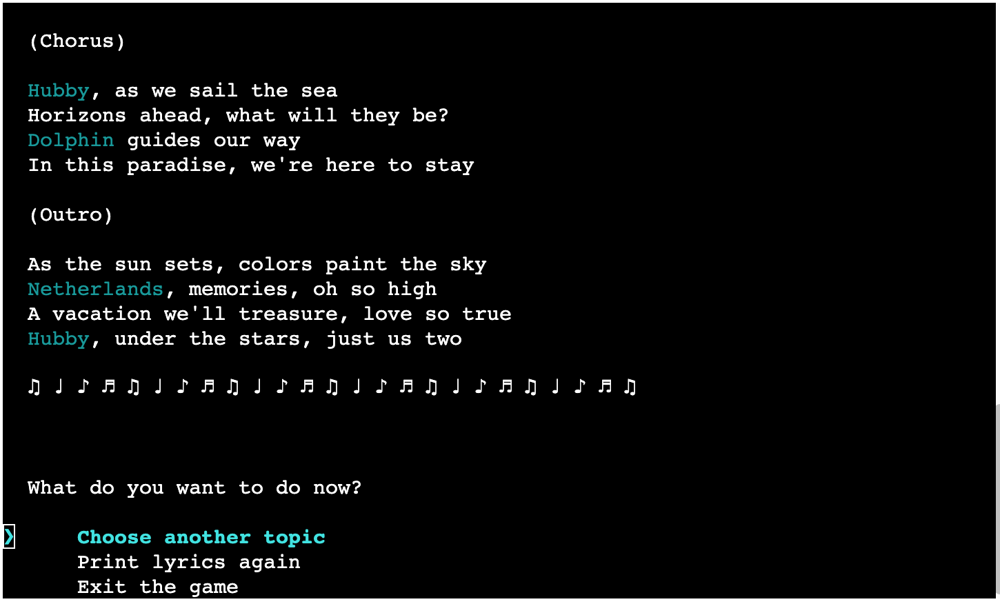
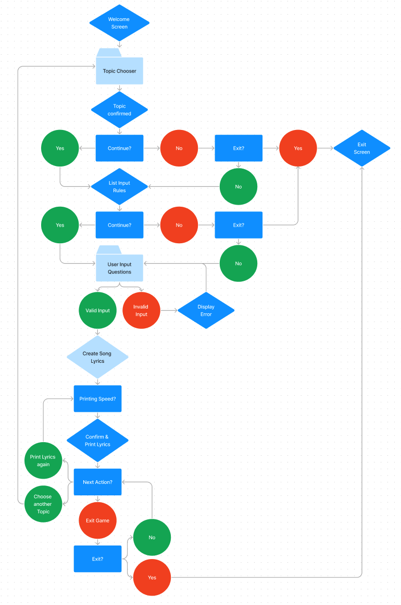

# Liric

**~The Song Lyric MadLibs Game~**

Liric is a MadLibs-style game where you create song lyrics based on a chosen topic. You'll be asked for various words, and then the game will generate and display the song lyrics for you. You can choose from different topics such as beach, love, and nature to customize the theme of your lyrics. Enjoy creating your unique song!

- [Deployed Liric Game](https://liric-89f62d9dc0a4.herokuapp.com/)

- [Liric repository on GitHub](https://github.com/DietkeSt/liric)

 

---
## How to Play

1. **Open the Link:** Open [this link](https://liric-89f62d9dc0a4.herokuapp.com/). Or copy this link text in your browser's address bar: `https://liric-89f62d9dc0a4.herokuapp.com/`

2. **Start the Game:** Click "Run Programm" on the page and you will be greeted by a welcome message.

3. **Choose a Topic:** Select a topic for your song lyrics from options like "Beach," "Love," or "Nature."

4. **Game Rules:** Read and understand the game rules, which ensure that your inputs will not be rejected.

6. **Print Lyrics:** After providing all the inputs, the game will generate song lyrics based on your choices. Choose a typing speed depending on how quickly you want to read the lyrics.

7. **View Lyrics:** Enjoy reading the song lyrics!

8. **More fun:** After viewing the lyrics, you have options like choosing another topic, printing the lyrics again, or exiting the game.

*Remember, the goal is to create entertaining and creative lyrics based on your chosen topic. Enjoy the process and get creative!*

---

## User Stories

### First Time Visitor Stories:

| Goal | Scenario |
| ------------- | ------------- |
| As a first-time visitor, I want to understand how to play the game quickly, so I can start creating lyrics.   | When I visit the game for the first time, I want to see a clear and concise tutorial or welcome message that explains the game's rules and how to choose a topic and provide input. I want the instructions to be easy to follow so I can get started right away.   |
| As a first-time visitor, I want to explore different topics for song lyrics, so I can see the game's variety.   | When I start the game, I want to have a menu where I can choose from various topics like "beach," "love," or "nature." I want to be able to select a topic that interests me, and I expect the game to generate lyrics related to that topic.   |
| As a first-time visitor, I want to enjoy a visually appealing and engaging experience, so I can have fun while playing the game.   | When I play the game, I want to see colorful text, animations, and an overall visually pleasing interface. I expect the game to provide an enjoyable experience with attention to detail, making it more entertaining.   |

### Frequent Visitor Stories:

| Goal | Scenario |
| ------------- | ------------- |
| As a frequent visitor, I want to challenge myself by choosing different topics each time, so I can explore various creative possibilities.   | When I play the game again, I want to deliberately choose different topics for song lyrics to challenge my creativity. I expect the game to remember my previous choices but allow me to start fresh with a new topic.   |
| As a frequent visitor, I want to have the option to replay the generated lyrics at different typing speeds, so I can enjoy the lyrics in different ways. | After generating lyrics, I want the ability to replay them at a slower or faster typing speed to experience the lyrics differently. I expect the game to provide a menu where I can choose the desired speed.   |
| As a frequent visitor, I want to see updates or new features in the game, so I can continue to enjoy and be engaged with it over time.   | When I return to the game, I hope to see updates such as new topics, additional rules, or improved visual elements that keep the game fresh and exciting. I expect the game to evolve and provide a reason to revisit it.   |

---

## Features

### Welcome, and Topic Chooser:

- The user is greeted by a title animation and a welcome message, which follows the first request to select a topic for the song lyrics.

### Topic Confirmation:

- After choosing a topic the game confirms the choice and gives the user the option to exit, in case the user changes their mind and wants to start from the beginning.

### Game Input Rules:

- After the user continues the game presents the input rules to make it easier for the user to avoid any input errors.

### Input Request

- The user is prompted to provide words by naming different places, names and animals. After hitting enter the next prompt request is shown until all words are provided.

### Loading Bar

- For a better user experience to keep the user engaged a loading bar animation is displayed after all words are provided. 

### Printing Speed
- The user is then presented with a choice of different printing speeds, depending on how fast the lyrics should be typed out.

### Printed Lyrics

- The user gets a confirmation of the typing speed and the lyrics are printed right away with a typing effect.
- The lyrics highlight the words the user provided for a better reading experience.

### Next Action

- An option menu is presented, the user can choose another topic and will be asked to provide words for that topic, print the lyrics again at a different speed, or exit the game. 

### Exit Screen

- When the user wants to exit the game a confirmation request opens, explaining that all progress will be lost upon exiting the game.
- The user is then shown an exit screen animation with instructions on how to restart the game.

### General UX Features

- Use of consistent color to highlight important text.
- Highlight topic names in their representative color.
- Use Terminal Menu options throughout for ease of navigation. The user does not have to input the choices themselves, but can just select them with the up and down arrows on the keyboard.
- Is not rushed through the game, as the terminal will ask the user if they want to continue or not at several checkpoints in the game.
- Use of typing speed options to make it easier to read the text while it is typed out.
- Use of typing effect that gives the sense of a human interaction experience.

## Flowchart

The flowchart presents the logic of the game:

  