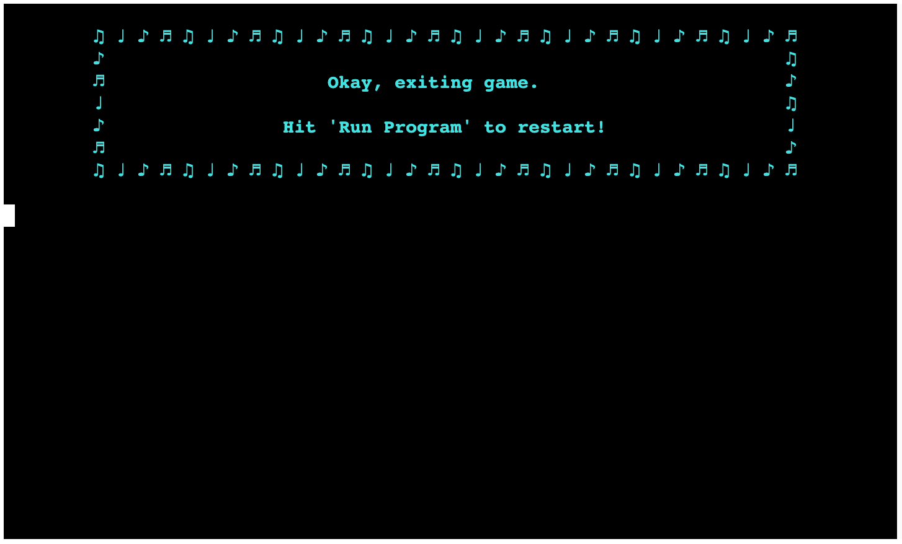

# Liric - A Song Lyric MadLib Game ♪♫

Liric is a MadLibs-style game where you create song lyrics based on a chosen topic. You'll be asked for various words, and then the game will generate and display the song lyrics for you. You can choose from different topics such as beach, love, and nature to customize the theme of your lyrics. Enjoy creating your unique song!

- [Live Version of the Liric Game](https://liric-89f62d9dc0a4.herokuapp.com/)

- [Liric repository on GitHub](https://github.com/DietkeSt/liric)

 

---
## How to Play

1. **Open the Link:** Open [this link](https://liric-89f62d9dc0a4.herokuapp.com/). Or copy this link text in your browser's address bar: `https://liric-89f62d9dc0a4.herokuapp.com/`

2. **Start the Game:** Click "Run Programm" on the page and you will be greeted by a welcome message.

3. **Choose a Topic:** Select a topic for your song lyrics from options like "Beach," "Love," or "Nature."

4. **Game Rules:** Read and understand the game rules, which ensure that your inputs will not be rejected.

6. **Print Lyrics:** After providing all the inputs, the game will generate song lyrics based on your choices. Choose a typing speed depending on how quickly you want to read the lyrics.

7. **View Lyrics:** Enjoy reading the song lyrics!

8. **More fun:** After viewing the lyrics, you have options like choosing another topic, printing the lyrics again, or exiting the game.

*Remember, the goal is to create entertaining and creative lyrics based on your chosen topic. Enjoy the process and get creative!*

---

## User Stories

### First Time Visitor Stories:

| Goal | Scenario |
| ------------- | ------------- |
| As a first-time visitor, I want to understand how to play the game quickly, so I can start creating lyrics.   | When I visit the game for the first time, I want to see a clear and concise tutorial or welcome message that explains the game's rules and how to choose a topic and provide input. I want the instructions to be easy to follow so I can get started right away.   |
| As a first-time visitor, I want to explore different topics for song lyrics, so I can see the game's variety.   | When I start the game, I want to have a menu where I can choose from various topics like "beach," "love," or "nature." I want to be able to select a topic that interests me, and I expect the game to generate lyrics related to that topic.   |
| As a first-time visitor, I want to enjoy a visually appealing and engaging experience, so I can have fun while playing the game.   | When I play the game, I want to see colorful text, animations, and an overall visually pleasing interface. I expect the game to provide an enjoyable experience with attention to detail, making it more entertaining.   |


### Frequent Visitor Stories:

| Goal | Scenario |
| ------------- | ------------- |
| As a frequent visitor, I want to challenge myself by choosing different topics each time, so I can explore various creative possibilities.   | When I play the game again, I want to deliberately choose different topics for song lyrics to challenge my creativity. I expect the game to remember my previous choices but allow me to start fresh with a new topic.   |
| As a frequent visitor, I want to have the option to replay the generated lyrics at different typing speeds, so I can enjoy the lyrics in different ways. | After generating lyrics, I want the ability to replay them at a slower or faster typing speed to experience the lyrics differently. I expect the game to provide a menu where I can choose the desired speed.   |
| As a frequent visitor, I want to see updates or new features in the game, so I can continue to enjoy and be engaged with it over time.   | When I return to the game, I hope to see updates such as new topics, additional rules, or improved visual elements that keep the game fresh and exciting. I expect the game to evolve and provide a reason to revisit it.   |

---

## Features

### Welcome, and Topic Chooser:

- The user is greeted by a title animation and a welcome message, which follows the first request to select a topic for the song lyrics.


### Topic Confirmation:

- After choosing a topic the game confirms the choice and gives the user the option to exit, in case the user changes their mind and wants to start from the beginning.


### Game Input Rules:

- After the user continues the game presents the input rules to make it easier for the user to avoid any input errors.


### Input Request

- The user is prompted to provide words by naming different places, names and animals. After hitting enter the next prompt request is shown until all words are provided.


### Loading Bar

- For a better user experience to keep the user engaged a loading bar animation is displayed after all words are provided. 


### Printing Speed
- The user is then presented with a choice of different printing speeds, depending on how fast the lyrics should be typed out.


### Printed Lyrics

- The user gets a confirmation of the typing speed and the lyrics are printed right away with a typing effect.
- The lyrics highlight the words the user provided for a better reading experience.


### Next Action

- An option menu is presented, the user can choose another topic and will be asked to provide words for that topic, print the lyrics again at a different speed, or exit the game. 


### Exit Screen

- When the user wants to exit the game a confirmation request opens, explaining that all progress will be lost upon exiting the game.
- The user is then shown an exit screen animation with instructions on how to restart the game.



### General UX Features

- Use of consistent color to highlight important text.
- Highlight topic names in their representative color.
- Use Terminal Menu options throughout for ease of navigation. The user does not have to input the choices themselves, but can just select them with the up and down arrows on the keyboard.
- Is not rushed through the game, as the terminal will ask the user if they want to continue or not at several checkpoints in the game.
- Use of typing speed options to make it easier to read the text while it is typed out.
- Use of typing effect that gives the sense of a human interaction experience.

### Future Features

- Add new topics, additional rules, and improved visual elements that keep the game fresh and exciting.
- Allow multiple players to collaborate on creating lyrics together. Players can take turns filling in blanks or provide input for different parts of the song.
- Implement a scoring system to rate the creativity of generated lyrics. Players can compete for high scores and see their rankings on leaderboards.
- Implement user accounts and profiles where players can save their favorite lyrics, track their progress, and earn achievements or badges.

---

## Flowchart

The flowchart presents the logic of the game:

  

---

## Technologies Used

### Languages:

- [Python 3.11.5](https://www.python.org/downloads/release/python-3115/): used to create game app and direct all behavior.

### Frameworks/Libraries, Programmes and Tools:
#### Python modules/packages:

##### Standard library imports:

- [os](https://docs.python.org/3/library/os.html): The os library provides a way to interface with the operating system. It's used for clearing the terminal screen using os.system().

- [sys](https://docs.python.org/3/library/sys.html): The sys library is used to access system-specific parameters and functions. In this code, it's primarily used for exiting the game with sys.exit().

- [time](https://docs.python.org/3/library/time.html): The time library is used for managing time-related operations. It's used for adding delays, creating a typing effect, and controlling timing throughout the game.

- [random](https://docs.python.org/3/library/random.html): The random library is used for generating random numbers. In the code, it's used to introduce randomness in the typing speed for the simulated typing effect.

- [re](https://docs.python.org/3/library/re.html): The re library provides support for regular expressions. In this code, it's used for validating user input to ensure it meets certain criteria, such as containing at least one letter.

- [textwrap](https://docs.python.org/3/library/textwrap.html): The textwrap library is used for text formatting. It's employed to format and wrap text within the terminal to ensure readability.

##### Third-party imports:

- [tqdm](https://pypi.org/project/tqdm/): The tqdm library is used to create progress bars. In the code, it's utilized to display a progress bar during the lyric generation process to provide visual feedback to the user.

- [simple_term_menu](https://pypi.org/project/simple-term-menu/): The simple_term_menu library is used for creating terminal menus. It enables the game to present menu options to the user, such as choosing a topic or selecting a typing speed.

- [colorama](https://pypi.org/project/colorama/): The colorama library is used to add color and style to text printed in the terminal. It's employed to create visually appealing and colorful text elements in the game, such as titles and topic names.

#### Other tools:

- [VSCode](https://code.visualstudio.com/) was used as the Development Environment to maintain, write and edit code.
- [Git](https://git-scm.com/) was used for the Version Control of the game.
- [GitHub](https://github.com/) is used to host the code in the Version Control Repository.
- [Heroku](https://render.com/) was used to deploy the project and is hosting the game in the Cloud Infrastructure.
- [Canva](https://www.canva.com/) was used to create and resize images for the README file.
- [FigJam](https://www.figma.com/figjam/) was used to make a flowchart for the README file.

---

## Bugs

### Solved Bugs:

1. The function `slow_print()` was not working as expected. The slow typing effect was not applied.

    - **Solution:** The space in the `end=" "` parameter was causing the issue. Removing the space fixed it. 
    ```Python
    def slow_print(text):
    """
    This function uses the time module to delay
    printing each character to achieve a typing effect.
    """
    for char in text:
        print(char, end=" ", flush=True)
        time.sleep(0.05)
    print()
    ```

2. The error handling function `def get_valid_input()` was not allowing names like C3P0, even though I wanted to allow it.

    - **Solution:** The match checker line was the issue. It did not include numbers, so no numbers would be allowed for the user input.

        Changed from: `re.match(r'^[A-Za-z0-9À-ÖØ-öø-ÿ\s\'-]+$', user_input)`
                        
        To: `re.match(r'^[A-Za-z0-9À-ÖØ-öø-ÿ\s\'-]+$', user_input)`

### Remaining Bugs:

- No remaining bugs.

---

## Testing

The code and game functionality were constantly tested, fixed and improved during the development process. The text and lyrics were also proofread by other people to spot potential errors.

### Validators

Code Institute's [PEP8 Python Validator](https://pep8ci.herokuapp.com/#) was used to ensure that the code is PEP8-compliant.

No errors were found:

#### run.py


#### lyric_templates_py


#### Potential Issues

Please note that both code files have the required empty line at the end of the code. Github might not show the last empty line correctly, so I am adding the relevant screenshot to showcase this:


---

## Deployment

- The code was deployed to [Heroku](https://heroku.com).
- The live deployment can be reached via [this link](https://liric-89f62d9dc0a4.herokuapp.com/).


### To deploy the project locally:

**Note:** This project requires you to have Python installed on your local PC. Depending on your OS, you may need to use apt-get instead of apt.

1. Install Python:
  
     `sudo apt install python3`

2. Install pip:
      
      `sudo apt install python3-pip`

 
3. Create a local copy of the GitHub repository by following either option below:

    - Download ZIP file:

        - Go to the liric GitHub Repo page.

        - Click the Code button and download the ZIP file containing the project.

        - Extract the ZIP file to a location on your PC.


    - Clone the repository:

        - Open a folder on your computer in the terminal.
        - Run the following command:

            `git clone https://github.com/DietkeSt/liric.git`
        
            `cd liric`

4. Install Python module dependencies using either pip or pip3 (choose one consistently):

    `pip install -r requirements.txt`

    OR

    `pip3 install -r requirements.txt`


### To deploy the project to Heroku:

1. Clone the repository:

    - Open a folder on your computer with the terminal.
    - Run the following command:

        `git clone https://github.com/DietkeSt/liric.git`

2. Create your own GitHub repository to host the code.

3. Run the command to set the remote repository location to your repository:

    `git remote set-url origin <Your GitHub Repo Path>`

4. Push the files to your repository with the following command:

    `git push`

5. Create a Heroku account if you don't already have one here: [Heroku](https://dashboard.heroku.com/).

6. Create a new Heroku application on the [Heroku App page](https://dashboard.heroku.com/apps).

7. Go to the Deploy tab.

8. Link your GitHub account and connect the application to the "liric" repository you created.

9. Go to the Settings tab.

10. Click "Add buildpack."

11. Add the Python and Node.js buildpacks in the following order:
    
    1. `heroku/python`

    2. `heroku/nodejs`

12. Click "Reveal Config Vars."

13. Add 1 new Config Var:

    - Key: PORT Value: 8000

    - *This Config was provided by [CODE INSTITUTE](https://codeinstitute.net/ie/).*


14. Go back to the Deploy tab.

15. Click "Deploy Branch."

16. Wait for the completion of the deployment.

17. Click "Open app" to launch the "liric" application inside a web page on Heroku.

---